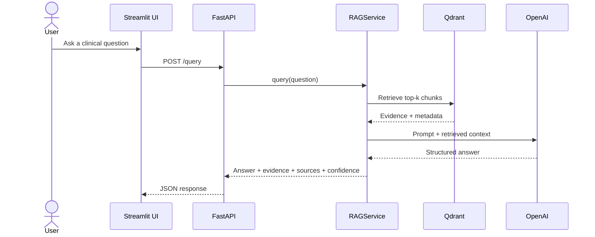

# MedRAG

MedRAG is an evidence-grounded clinical guideline question-answering application. It parses approved guideline PDFs and configured PubMed results, indexes their content in Qdrant, retrieves relevant passages for a question, and uses an OpenAI model to produce a structured answer with evidence, source metadata, confidence, and an educational-use disclaimer.

> **Branch scope:** `main` contains the baseline RAG, source-management, evaluation, UI, Docker, and AWS deployment implementation. API input/output guardrails are developed separately on [`feature/io-guardrails`](https://github.com/yashprogrammer/MedRAG_live/tree/feature/io-guardrails).

The illustrated [MedRAG project report](output/pdf/MedRAG_Project_Report.pdf) summarizes the problem, operating model, architecture, implementation, safety posture, product experience, and recommended next steps.

MedRAG is an educational evidence assistant. It does not diagnose, prescribe, replace a clinician, or guarantee that indexed guidance is complete or current.

## What it provides

- Clinical guideline PDF ingestion and structure-aware chunking with Docling
- Configurable PubMed abstract ingestion
- Local FastEmbed embeddings using `BAAI/bge-small-en-v1.5`
- Qdrant-backed dense or hybrid retrieval
- OpenAI-generated answers grounded in retrieved context
- Typed answers containing evidence, sources, and confidence
- PDF source upload, deletion, listing, and explicit reindexing
- DeepEval checks for faithfulness, answer relevancy, and contextual relevancy
- CLI, FastAPI, and Streamlit interfaces over one shared `RAGService`
- Docker Compose for local execution and AWS deployment assets for production

## Architecture

```mermaid
flowchart TB
    subgraph IF["Interfaces"]
        CLI["CLI<br/>src/cli.py"]
        API["FastAPI<br/>src/api/main.py"]
        UI["Streamlit UI<br/>src/ui/app.py"]
    end

    SVC["RAGService<br/>src/core/service.py"]
    REG["Project registry<br/>src/projects.py"]

    subgraph MED["MedRAG project"]
        CFG["config.py<br/>prompt + metadata"]
        ING["ingestor.py<br/>PDF + PubMed ingestion"]
        DOC["Docling<br/>DocumentConverter"]
    end

    subgraph CORE["Reusable RAG core"]
        IDX["indexer.py<br/>HybridChunker + embeddings"]
        RET["retriever.py<br/>Qdrant retrieval"]
        GEN["generator.py<br/>OpenAI generation"]
    end

    FE["FastEmbed<br/>BAAI/bge-small-en-v1.5"]
    QD[(Qdrant)]
    OAI["OpenAI API"]
    NCBI["NCBI E-utilities"]

    UI -->|HTTP JSON| API
    CLI --> SVC
    API --> SVC

    SVC --> REG
    REG --> CFG
    REG --> ING

    ING -->|Guideline PDFs| DOC
    ING -->|PubMed queries| NCBI

    DOC --> IDX
    NCBI --> ING
    ING --> IDX

    IDX --> FE
    IDX --> QD

    SVC --> RET
    RET --> QD

    SVC --> GEN
    GEN --> OAI
    ```

The Streamlit UI is a pure API client. The CLI is a developer interface that calls `RAGService` directly. Project-specific behavior stays in `src/projects/medrag/`, while indexing, retrieval, generation, schemas, evaluation, and source management remain reusable.

## Indexing flow

The Docker `indexer` service runs this flow once at startup. You can also invoke it with `rag-toolkit index --project medrag`.

```mermaid
flowchart LR
    A["Guideline PDFs"] --> B["Docling DocumentConverter"]
    B --> C["Structured DoclingDocument"]
    C --> D["Docling HybridChunker"]

    E["PubMed queries"] --> F["NCBI E-utilities"]
    F --> G["Title + abstract"]
    G --> H["Plain-text chunking"]

    D --> I["Metadata enrichment"]
    H --> I

    I --> J["FastEmbed"]
    J --> K[("Qdrant collection")]
```

Each document is enriched with `source_org`, `specialty`, and `evidence_type`. `--skip-if-exists` leaves an existing collection unchanged; use the source reindex endpoint or remove the collection when a rebuild is required.

## Query flow



## Repository layout

| Path | Purpose |
|---|---|
| `src/core/` | Reusable RAG service, indexing, retrieval, generation, schemas, evaluations, settings, and source management |
| `src/projects/medrag/` | MedRAG prompt, metadata policy, data directory, and clinical source ingestion |
| `src/api/main.py` | FastAPI endpoints |
| `src/ui/app.py` | Streamlit HTTP client |
| `src/cli.py` | Index and query commands |
| `eval/medrag/` | Golden dataset and DeepEval suite |
| `docs/` | AWS deployment documentation |
| `infra/cloudformation/` | Production AWS infrastructure template |
| `scripts/` | Deployment, packaging, bootstrap, teardown, and report-generation utilities |
| `output/pdf/` | Generated MedRAG project report |

## Quick start with Docker

Requirements:

- Docker with Compose
- Groq API key

```bash
cp .env.example .env
# Set GROQ_API_KEY in .env
docker compose up -d --build
```

Once the indexer completes:

- Streamlit UI: http://localhost:8501
- FastAPI documentation: http://localhost:8000/docs
- Health endpoint: http://localhost:8000/health

Useful commands:

```bash
docker compose ps
docker compose logs -f indexer api ui
docker compose down
```

## Configuration

| Variable | Default | Purpose |
|---|---|---|
| `ACTIVE_PROJECT` | `medrag` | Registered project to load |
| `GROQ_API_KEY` | - | Required for answer generation and Groq-based evaluation |
| `QDRANT_HOST` / `QDRANT_PORT` | `localhost` / `6333` | Vector store connection |
| `GROQ_MODEL` | `openai/gpt-oss-120b` | Groq generation and evaluation model  |
| `GROQ_BASE_URL` | `https://api.groq.com/openai/v1` | Groq OpenAI-compatible API endpoint |
| `EMBEDDING_MODEL` | `BAAI/bge-small-en-v1.5` | Local embedding model |
| `EMBEDDING_OUTPUT_DIMENSIONALITY` | `384` | Vector dimensionality |
| `EMBEDDING_BATCH_SIZE` | `16` | Embedding batch size |
| `MAX_GUIDELINE_FILES` | `3` | Maximum PDFs parsed during an index build |
| `PUBMED_ENABLED` | `true` | Enable configured PubMed ingestion |
| `PUBMED_QUERY_LIMIT` | `1` | Number of configured PubMed queries to execute |
| `PUBMED_MAX_RESULTS` | `5` | Maximum abstracts per query |
| `CHUNK_SIZE` / `CHUNK_OVERLAP` | `1024` / `100` | Docling chunk token budget and plain-text fallback overlap |
| `VECTOR_STORE_QUERY_MODE` | `default` | `default` or `hybrid` retrieval |
| `SIMILARITY_TOP_K` | `1` | Dense retrieval candidate count |
| `SPARSE_TOP_K` | `8` | Sparse retrieval candidate count for hybrid mode |
| `HYBRID_ALPHA` | `0.5` | Dense/sparse weighting in hybrid mode |
| `API_BASE_URL` | `http://localhost:8000` | API address used by Streamlit outside Compose |

The one-shot `indexer` receives source-ingestion settings in `docker-compose.yml`. The API container does not receive `MAX_GUIDELINE_FILES` or `PUBMED_*` variables in this branch, so an API-triggered reindex uses code defaults unless the Compose configuration is extended.

## API reference

| Method | Path | Purpose |
|---|---|---|
| `GET` | `/health` | Report project and collection readiness |
| `GET` | `/sources` | List uploaded PDFs and PubMed ingestion status |
| `POST` | `/sources/upload` | Upload a guideline PDF |
| `DELETE` | `/sources/{filename}` | Delete a guideline PDF |
| `POST` | `/sources/reindex` | Rebuild the configured Qdrant collection |
| `POST` | `/query` | Ask an evidence-grounded clinical question |
| `POST` | `/evals/medrag/run` | Run the MedRAG golden-dataset evaluation |
| `GET` | `/evals/medrag/latest` | Return the latest local evaluation result |

## Local development

Install dependencies with `uv`, then run quality checks:

```bash
uv sync --extra dev
uv run --extra dev ruff check src/ tests/
uv run --extra dev pytest
```

Start Qdrant locally, set the required environment variables, and use the CLI:

```bash
uv run python -m src.cli index --project medrag --skip-if-exists
uv run python -m src.cli query "What do guidelines say about first-line hypertension therapy?" --project medrag
```

The DeepEval integration test requires an indexed collection and model access; it is skipped when those dependencies are unavailable.

## Production deployment

Production assets include Docker Compose, Nginx configuration, EC2 bootstrap and deployment scripts, CloudFormation infrastructure, and GitHub Actions workflows. Follow [`docs/aws_deployment_guide.md`](docs/aws_deployment_guide.md) before running a deployment or teardown workflow.

Do not commit populated `.env` files or clinical data. Before sensitive use, add authentication, authorization, audit logging, retention controls, monitoring, privacy/security review, and clinician-led validation appropriate to the deployment context.
